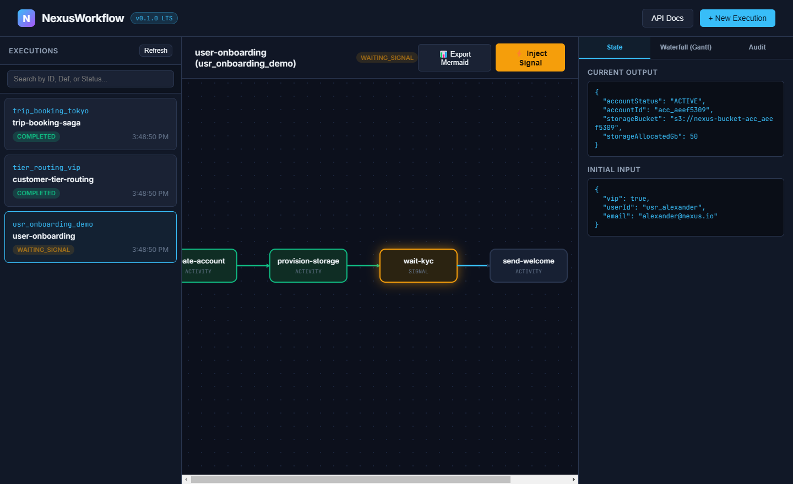
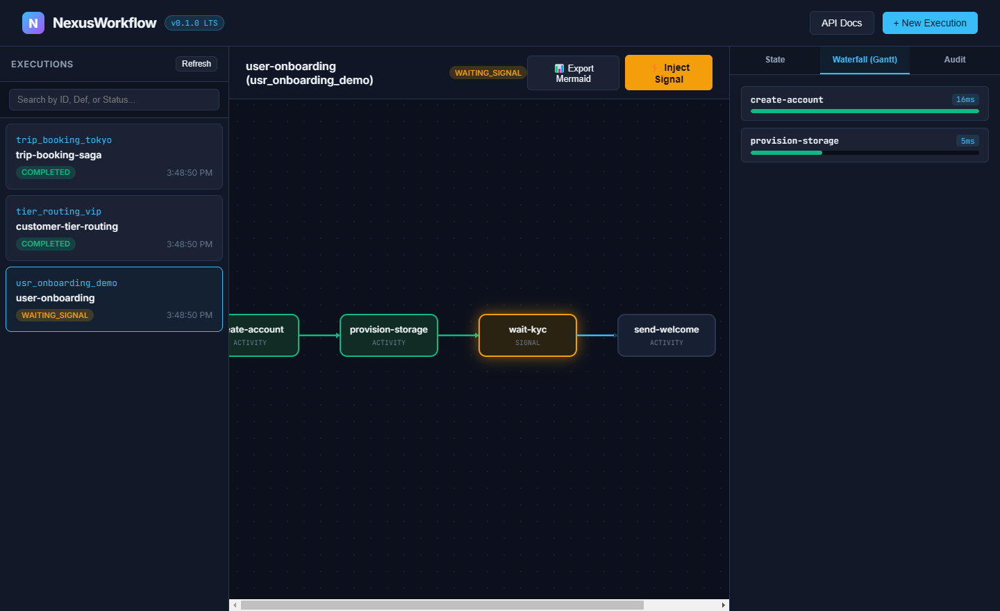
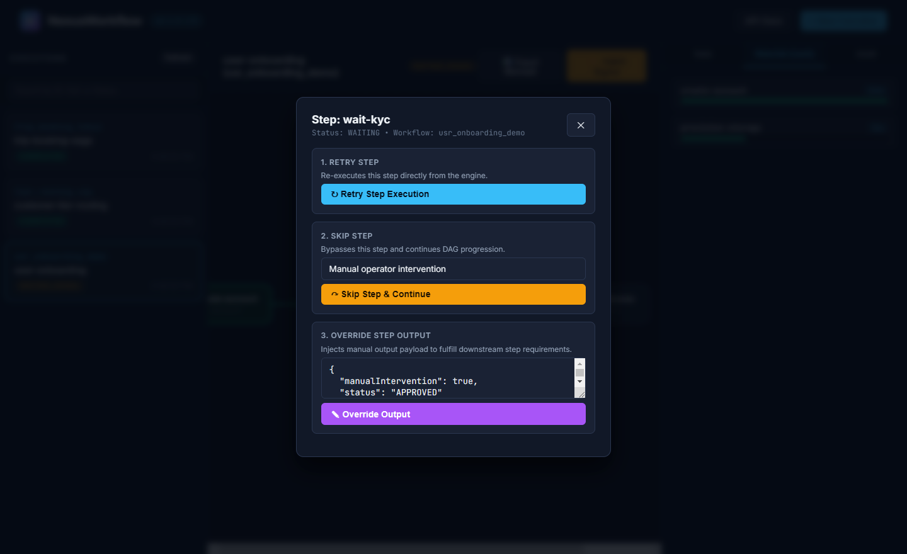

<p align="center">
  
</p>

<h1 align="center">NexusWorkflow</h1>

<p align="center">
  <a href="https://github.com/alexandrmotologa/nexus-workflow/actions/workflows/ci.yml"></a>
  
  
  
  
  
</p>

<p align="center">
  Code-first distributed workflow and DAG engine in Java 21 with event-sourced durable execution, virtual threads, backward saga compensation, snapshots, idempotency keys, and an interactive SVG dashboard.
</p>

---

```
                       +-----------------------------------+
                       |      REST API / Web Dashboard     |
                       +-----------------+-----------------+
                                         |
                            (Start / Signal / Intervene)
                                         v
+-------------------------------------------------------------------------+
|                              Nexus Engine                               |
|                                                                         |
|  +------------------------+                     +--------------------+  |
|  |     Workflow DSL       |                     | Deterministic      |  |
|  | (Code-First Java 21)   |                     | Replay Engine      |  |
|  +-----------+------------+                     +---------+----------+  |
|              |                                            |             |
|              +--------------------+-----------------------+             |
|                                   |                                     |
|                       Java 21 Virtual Threads                           |
|                       (Concurrent Task Runner)                          |
|                                   |                                     |
|              +--------------------+-----------------------+             |
|              |                                            |             |
|              v                                            v             |
|  +------------------------+                     +--------------------+  |
|  |   Saga Coordinator     |                     | Signal & Timer     |  |
|  | (Backward Compensate)  |                     | (Chronos / V-Th)   |  |
|  +------------------------+                     +--------------------+  |
|              |                                            |             |
|              v                                            v             |
|  +------------------------+                     +--------------------+  |
|  |   Operator Intervene   |                     | Snapshot & Idemp.  |  |
|  | (Retry / Skip / Force) |                     | (O(1) Replay / Key)|  |
|  +------------------------+                     +--------------------+  |
+-----------------------------------+-------------------------------------+
                                    |
            +-----------------------+-----------------------+
            |                                               |
            v                                               v
+-----------------------+                       +-----------------------+
|  nexus_workflow_      |                       |  nexus_workflow_      |
|  instances & snapshots|                       |  events (Append-Only) |
+-----------------------+                       +-----------------------+
```

## Overview

Backend workflows like customer onboarding, KYC document validation, and travel booking sagas often involve long delays, human approvals, or multi-step rollbacks. Configuring these in static JSON or XML definitions separates business logic from code and complicates local debugging.

NexusWorkflow lets you write workflows directly in Java 21 using standard functions and a fluent builder. Every state transition is stored in an append-only PostgreSQL event table. If a worker pod crashes mid-execution, a standby worker reloads the instance history, replays completed steps without re-executing external network calls, and continues execution.

## Key Capabilities

- **Code-First Java 21 DSL**: Define multi-step DAGs with activity calls, conditional branching, child workflows, sleeps, external signals, and parallel branches directly in Java.
- **Durable Event-Sourced Execution**: Completed step outputs are stored as immutable events. On crash recovery, completed activities return cached outputs and avoid duplicate side effects.
- **Periodic Snapshotting**: Periodically captures state checkpoints in `nexus_workflow_snapshots` to provide fast O(1) recovery on large workflows without replaying thousands of historical events.
- **HTTP Idempotency Keys**: Submit requests with an `Idempotency-Key` header to safely retry execution requests without triggering duplicate runs.
- **Conditional Branching**: Dynamic runtime routing (`choose(stepId, condition, thenBranch, otherwiseBranch)`) based on workflow state.
- **Hierarchical Child Workflows**: Spawn dedicated sub-workflows (`childWorkflow(...)`) that execute concurrently and feed results back to the parent DAG.
- **Manual Operator Interventions**: Retry failed steps, skip broken steps, or override step outputs via dedicated REST endpoints and the UI console.
- **Real-Time Webhooks**: Broadcast workflow status changes (`RUNNING`, `WAITING_SIGNAL`, `COMPLETED`, `FAILED`) to registered subscriber URLs.
- **Non-Determinism Detection**: Detects if code modifications altered step ordering for in-flight workflows, throwing a `NonDeterministicException` before state corruption occurs.
- **Backward Saga Compensation**: When an activity exhausts its retries, the engine navigates backward through completed steps and executes declared compensation routines in reverse order.
- **Java 21 Virtual Threads**: Workflow execution runs on lightweight virtual threads (`Executors.newVirtualThreadPerTaskExecutor()`), keeping memory usage low during concurrency.
- **Interactive SVG Dashboard**: Built-in web dashboard at `http://localhost:8080/dashboard` featuring live DAG visualization, a Gantt waterfall timeline, operator action modals, search filters, and one-click Mermaid diagram export.

## Visual Tour & Dashboard

NexusWorkflow includes an embedded web dashboard accessible at `http://localhost:8080/dashboard`. It provides real-time visual inspection and operational controls with zero external frontend dependencies.

### Live SVG DAG Visualizer
Workflows render as dynamic vector node graphs. Nodes update their visual styling based on real-time state transitions: emerald green for completed activities, amber with a pulsing glow for steps waiting on external signals, deep blue for in-flight tasks, and crimson for failures.



### Latency Waterfall (Gantt View)
The Gantt timeline inspects step execution latency across concurrent branches, identifying slow network activities and execution bottlenecks.



### Operator Intervention Console
Operators can click directly on any step or use action triggers to manually intervene in running or stuck workflows. Options include re-running a failed step, skipping an optional step with an audit reason, or injecting an override JSON payload to keep downstream nodes moving.



## Architecture

NexusWorkflow follows Hexagonal Architecture:

- `domain`: Pure Java 21 domain entities, records, and sealed events. Contains zero dependencies on Spring, Hibernate, or Jackson. Enforced by ArchUnit tests.
- `application`: Fluent builder DSL, `WorkflowEngineImpl`, `DeterministicReplayEngine`, and `SagaCompensationCoordinator`.
- `infrastructure`: Spring Boot 3.3.3 adapters including PostgreSQL event store persistence, Flyway migrations, REST controllers, webhooks, and the SVG dashboard.

## Defining a Workflow

```java
StepDefinition vipBranch = StepDefinition.activity(
    StepId.of("vip-upgrade"), 
    "VipUpgradeActivity", 
    RetryPolicy.none(), 
    null
);

StepDefinition standardBranch = StepDefinition.activity(
    StepId.of("standard-tier"), 
    "StandardTierActivity", 
    RetryPolicy.none(), 
    null
);

WorkflowDefinition workflow = Workflow.define("user-onboarding")
    .version(1)
    .step("create-account", "CreateAccountActivity", 
          RetryPolicy.builder().maxAttempts(3).build(), 
          "DeleteAccountActivity")
    .choose("evaluate-tier", state -> Boolean.TRUE.equals(state.get("vip")), vipBranch, standardBranch)
    .step("provision-storage", "ProvisionStorageActivity", 
          RetryPolicy.defaultPolicy(), 
          "ReleaseStorageActivity")
    .waitForSignal("wait-kyc", "ID_VERIFIED", Duration.ofHours(24))
    .step("send-welcome", "SendWelcomeEmailActivity")
    .onFailure("GlobalCleanupActivity")
    .build();
```

## Quick Start

### Prerequisites

- Java 21 LTS
- Maven 3.9+
- Docker and Docker Compose (optional for full stack run)

### Running Locally

1. Clone the repository:
   ```bash
   git clone https://github.com/alexandrmotologa/nexus-workflow.git
   cd nexus-workflow
   ```

2. Start PostgreSQL via Docker Compose:
   ```bash
   docker compose up -d nexus-postgres
   ```

3. Run the application:
   ```bash
   mvn spring-boot:run
   ```

4. Open your browser:
   - Live DAG Dashboard: `http://localhost:8080/dashboard`
   - OpenAPI Swagger UI: `http://localhost:8080/swagger-ui.html`
   - Prometheus Metrics: `http://localhost:8080/actuator/prometheus`

## REST API Reference

| Method | Endpoint | Description |
|---|---|---|
| `POST` | `/api/v1/workflows/{definitionId}/start` | Start a new workflow run (supports `Idempotency-Key` header) |
| `POST` | `/api/v1/workflows/{workflowId}/signals/{signalName}` | Deliver an external signal |
| `POST` | `/api/v1/workflows/{workflowId}/cancel` | Cancel an active execution |
| `POST` | `/api/v1/workflows/{workflowId}/steps/{stepId}/retry` | Operator: retry a failed step |
| `POST` | `/api/v1/workflows/{workflowId}/steps/{stepId}/skip` | Operator: skip step and continue execution |
| `POST` | `/api/v1/workflows/{workflowId}/steps/{stepId}/override` | Operator: override step output with custom payload |
| `POST` | `/api/v1/workflows/webhooks` | Register a webhook callback URL |
| `GET` | `/api/v1/workflows` | List workflow instances |
| `GET` | `/api/v1/workflows/{workflowId}/status` | Get current execution status |
| `GET` | `/api/v1/workflows/{workflowId}/history` | Get immutable event audit history |
| `GET` | `/api/v1/workflows/{workflowId}/live` | SSE stream for real-time updates |
| `GET` | `/api/v1/workflows/definitions` | List registered workflow definitions |

### Example: Starting with Idempotency Key

```bash
curl -X POST http://localhost:8080/api/v1/workflows/user-onboarding/start \
  -H "Content-Type: application/json" \
  -H "Idempotency-Key: order-req-99402" \
  -d '{"input": {"userId": "usr_7891", "vip": true}}'
```

### Example: Operator Step Intervention

```bash
# Skip a problematic step:
curl -X POST "http://localhost:8080/api/v1/workflows/wf_123/steps/step-2/skip?reason=BypassedByLead"

# Or override output with manual payload:
curl -X POST http://localhost:8080/api/v1/workflows/wf_123/steps/step-2/override \
  -H "Content-Type: application/json" \
  -d '{"approved": true, "manualOverride": true}'
```

## Running Tests

Run the test suite, including ArchUnit architecture enforcement, saga compensation tests, idempotency checks, and deterministic replay:

```bash
mvn clean test
```

## License

This project is licensed under the MIT License. See [LICENSE](LICENSE) for details.
